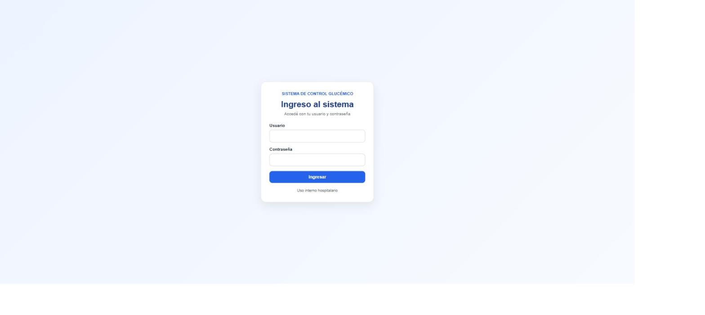
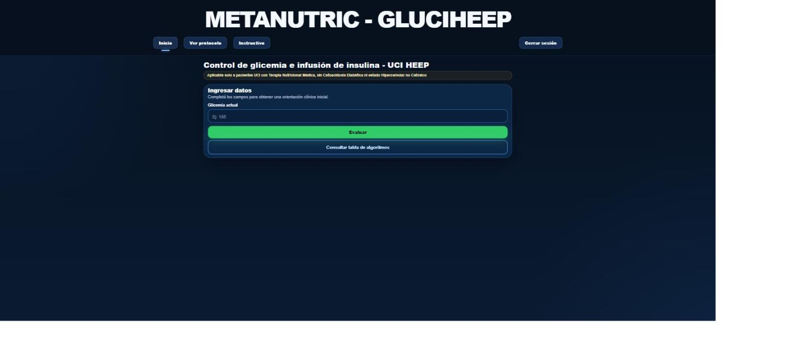
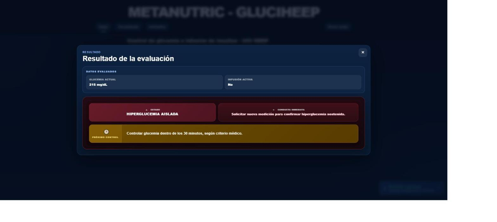
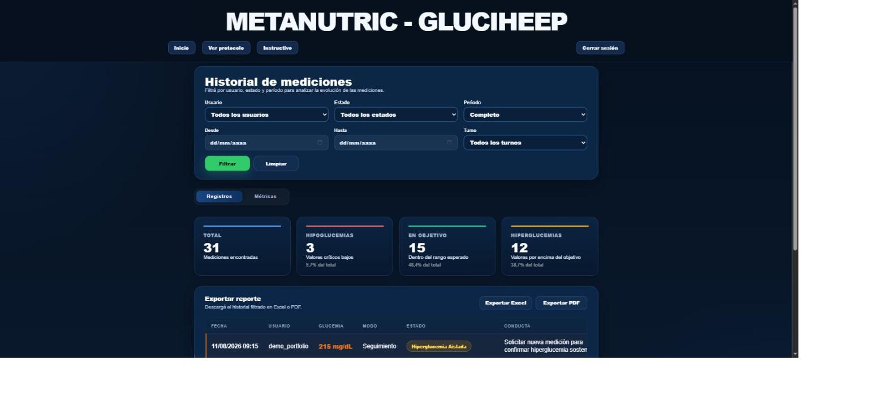
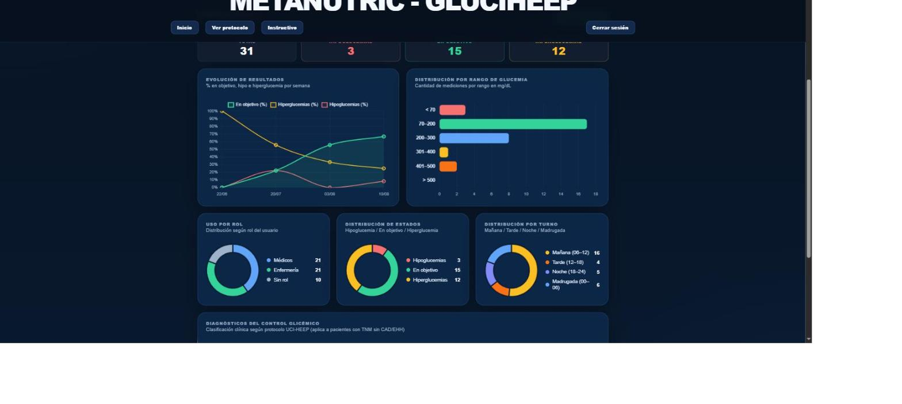

# METANUTRIC · Sistema de Control Glucémico (UCI)

Aplicación web desarrollada en Django para asistir al equipo de enfermería y médico en el
control de glicemia e infusión de insulina de pacientes en Unidad de Cuidados Intensivos (UCI),
siguiendo un protocolo clínico institucional de manejo de glucemia en nutrición crítica.

🔗 **Demo:** [138.36.238.175:8001/login](http://138.36.238.175:8001/login) (instancia real del
sistema — pedir credenciales de acceso)

> ⚠️ **Esta aplicación es una herramienta de apoyo informático.** Sistematiza y automatiza el
> cálculo según un protocolo clínico ya definido por el equipo médico, pero **no reemplaza el
> criterio médico ni de enfermería**. Toda decisión clínica final es responsabilidad del
> profesional de salud a cargo del paciente.

## El problema que resuelve

En una UCI, el control de glucemia de pacientes con terapia nutricional médica requiere
aplicar un protocolo con múltiples reglas (rangos, algoritmos de insulina, criterios de
hipoglucemia/hiperglucemia sostenida) de forma consistente, turno tras turno, entre distintos
profesionales. Hacerlo a mano es propenso a errores de cálculo y dificulta llevar un historial
analizable. Este sistema:

- Evalúa una medición de glucemia contra el protocolo y devuelve el estado clínico, la conducta
  inmediata y el próximo control sugerido.
- Registra cada evaluación con el usuario que la cargó, para trazabilidad.
- Permite a los roles con acceso a historial analizar la evolución por paciente/turno/período,
  con métricas y gráficos.
- Exporta reportes en Excel y PDF para auditoría o entrega de guardia.

## Para quién está pensado

Personal de enfermería y médico de una unidad de cuidados intensivos con acceso al sistema
(login con usuario y contraseña, por grupos de permisos).

## Funcionalidades principales

- **Control de glicemia**: carga de una medición, cálculo automático del estado clínico
  (hipoglucemia / en rango / hiperglucemia / hiperglucemia persistente o refractaria), conducta
  sugerida y próximo control, según protocolo.
- **Historial de mediciones**: filtros por usuario, estado, clase clínica, período, turno y
  rango de fechas; tarjetas resumen (total, hipoglucemias, en objetivo, hiperglucemias).
- **Panel de métricas**: evolución semanal, distribución por rango de glucemia, uso por rol,
  distribución de estados y por turno — todo en gráficos.
- **Exportación**: historial y métricas a Excel y PDF, con los mismos filtros aplicados.
- **Control de acceso por grupos** de Django (Enfermería, Médicos, Historial).

## Capturas de pantalla

| Login | Control de glicemia |
|---|---|
|  |  |

| Resultado de la evaluación | Historial de mediciones |
|---|---|
|  |  |

| Dashboard de métricas |
|---|
|  |

## Arquitectura

El proyecto separa responsabilidades en capas, en lugar de concentrar todo en las vistas:

```
views.py            → orquesta el request/response, llama a la capa de servicio
services.py         → capa delgada que delega en la lógica de negocio
utils/logic/         → lógica clínica pura (algoritmos del protocolo), sin dependencias de Django
utils/ui/             → adapta el resultado de la lógica para mostrarlo en el template
utils/reportes/       → generación de Excel (openpyxl) y PDF (reportlab)
```

Esto permite testear la lógica clínica de forma aislada (ver Testing) y mantener las vistas
enfocadas en HTTP, sin lógica de negocio mezclada.

## Stack

- **Backend:** Django 5.2
- **Base de datos:** SQLite en desarrollo (pensado para migrar a PostgreSQL en producción)
- **Frontend:** templates de Django + CSS propio + Chart.js para los gráficos del dashboard
- **Reportes:** openpyxl (Excel), reportlab (PDF)
- **Producción:** gunicorn + WhiteNoise para estáticos

## Instalación y ejecución local

```bash
git clone https://github.com/bereail/Glicemia-Calculadora.git
cd Glicemia-Calculadora

python -m venv venv
venv\Scripts\activate        # Windows
# source venv/bin/activate   # Linux/Mac

pip install -r requirements.txt

python manage.py migrate
python manage.py createsuperuser   # crear un usuario y asignarlo a un grupo (ver abajo)

python manage.py runserver
```

Abrir [http://127.0.0.1:8000](http://127.0.0.1:8000).

### Variables de entorno

La app funciona con valores por defecto pensados solo para desarrollo local. Para un entorno
real, configurar (por ejemplo en un archivo `.env` no versionado):

| Variable | Descripción |
|---|---|
| `DJANGO_SECRET_KEY` | Clave secreta de Django. Obligatoria en producción. |
| `DJANGO_DEBUG` | `False` en producción. |
| `DJANGO_ALLOWED_HOSTS` | Hosts/IPs permitidos, separados por coma. |
| `DJANGO_CSRF_TRUSTED_ORIGINS` | Orígenes confiables para CSRF, separados por coma. |
| `USE_HTTPS` | `True` si se sirve por HTTPS (activa cookies seguras y HSTS). |

### Usuarios y permisos

El acceso se controla por grupos de Django:

- **Enfermería** / **Médicos**: acceso a la carga de mediciones (`/`).
- **Historial**: acceso al historial y panel de métricas (`/historial/`).

Para crear un usuario de prueba con acceso completo:

```bash
python manage.py shell -c "
from django.contrib.auth.models import User, Group
for g in ['Enfermeria', 'Medicos', 'Historial']:
    Group.objects.get_or_create(name=g)
u = User.objects.create_user('demo', password='CAMBIAR_ESTA_CLAVE')
for g in ['Enfermeria', 'Medicos', 'Historial']:
    u.groups.add(Group.objects.get(name=g))
"
```

## Testing

El proyecto cuenta con **108 tests automatizados** sobre la lógica clínica y las vistas:

```bash
python manage.py test calculadora
```

## Estructura del proyecto

```
glicemia/              # configuración del proyecto (settings, urls)
calculadora/            # app principal: modelos, vistas, lógica clínica, reportes
analytics/               # registro de visitas y panel de administración de analíticas
templates/               # templates globales (login)
docs/screenshots/        # capturas para este README
```

## Mejoras futuras

- Demo pública desplegada con datos ficticios.
- Asociar mediciones a un paciente/cama (hoy se asocian al profesional que carga el dato).
- Migración a PostgreSQL para el entorno de producción.
